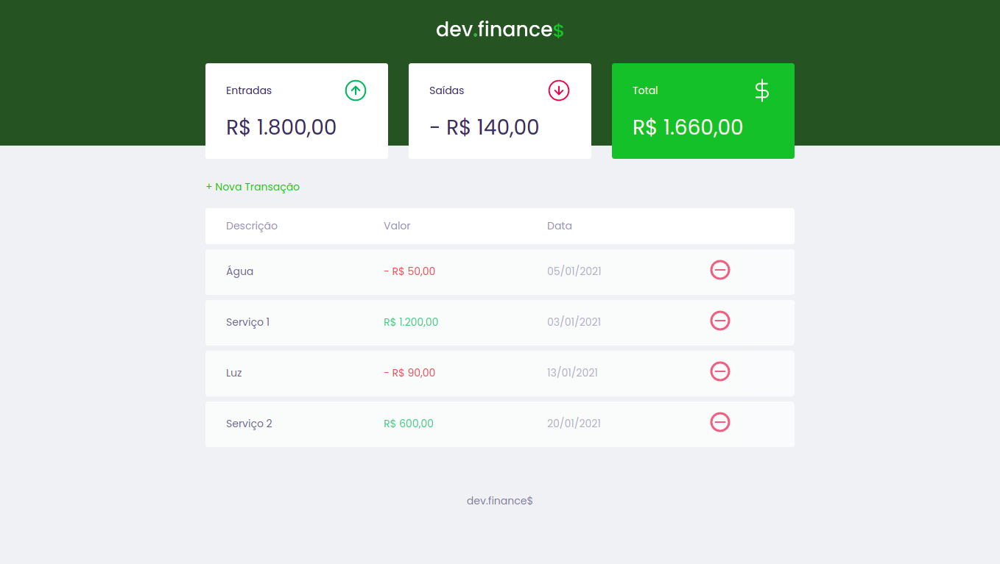
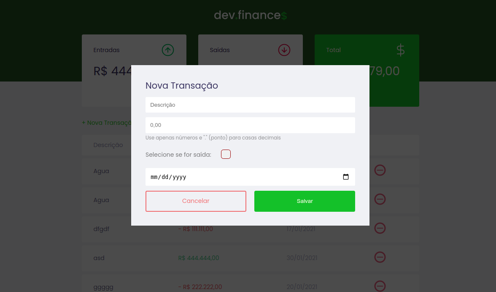
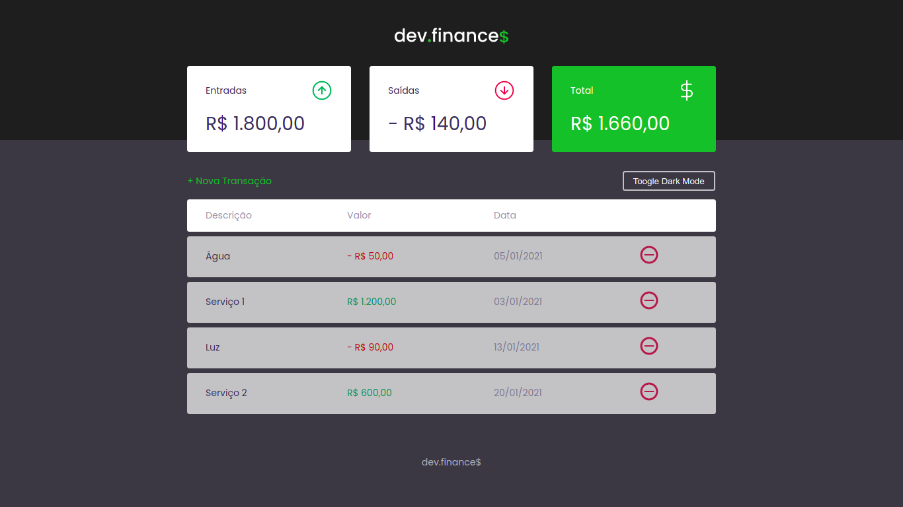

<h1 align="center">
    dev.finance$
</h1>

## 🚀 Tecnologias

Esse projeto foi desenvolvido com as seguintes tecnologias:

- HTML
- CSS
- Javascript

## 💻 Projeto

O devFinance é uma aplicação que ajuda as pessoas a monitorarem melhor o seu dinheiro! 💸

  

 

  

 

  

 

Feito por Gabriel Silva com ensinamentos da Rocketseat pelo Mestre Mayk Brito! 💜

### Mudanças Extras do projeto Original:

- Methodos open e close se tornaram um único: toogle( )
- Opção de despesa para não precisar escrever o valor negativo
- Dark Mode
